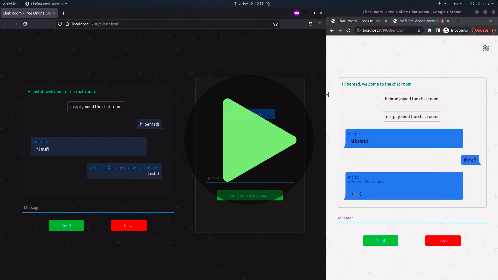

# Chatroom using PHP and JavaScript
# (PHP Socket Programming)

Hey there!

I've scripted a simple server confuguration in PHP in order to handle a simple chatroom with several clients from JavaScript and HTML or any other GUI that can connect to a URL's specific port.
I used the socket programming architecture and configured server on port number ```15000``` .
This server and client can be used in purpose of learning socket programming and networks.
I used json ecoding along side with WebSocket protocol in JavaScript and PHP.

## Usage
* Simply just install it using :
```
git clone https://github.com/TadavomnisT/php_javascript_chatroom.git
```
Then run `server.php` and open `client.html` in browser and start chatting :)

```
cd php_javascript_chatroom
php server.php
```

## IMPORTANT==============================================
## YOU MUST ENABLE `socket` EXTENTION IN YOUR PHP PACKAGE.
## IMPORTANT==============================================
if you recieved following error:
`couldn't load socket extention.`
it means you haven't load `socket` extetion properly, so then if you have installed it already just uncomment the line:
`;extension=php_sockets.dll ` to `extension=php_sockets.dll `
in your `php.ini` file , else in case that you didn't install it, in windows you should download `.dll` file and put in in dll directory in linux and mac you can install it by commandline .

## Demo:

#### [](./Documents/demo.mp4)

## Development Info
* Homepage: https://github.com/TadavomnisT/php_javascript_chatroom/
* Repo: https://github.com/TadavomnisT/php_javascript_chatroom/

## Author
* Behrad.B
* Contact: http://TadavomnisT.iR

## License
*  GPL-3.0 license 

Have fun!
